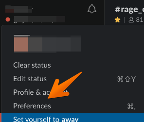
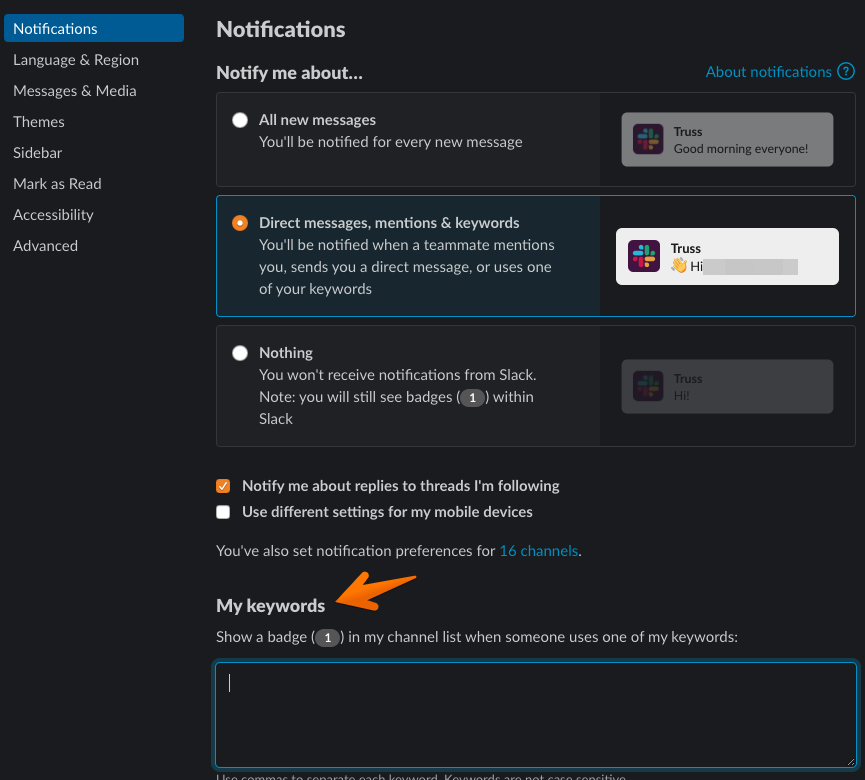

# [Tools and Practice](../README.md) / Slack Best Practices

## Overview

As a distributed team we rely heavily on slack for communication. Below is a collection of tips to make your life using slack better.

## Tips

### My Keywords

You are automatically alerted if someone uses your `@slackname` but sometimes it is helpful to also be alerted of other keywords. For example having your `githubusername` setup as a key word allows slack to ping you if a message comes in with your name in it. This should also apply if build failures come into slack automatically and have your github user name.

#### 1. Open Slack app preferences

#### 2. Add a comma separated list of keywords

Simply add a comma separated list of case insensitive keywords. `githubusername, last name` are a good start

#### 3. Close preferences

### Setup Automatic Do Not Distrub

Turning off work when you are done can be a challenge in distributed teams. One way to mitigate this is to turn on Do Not Disturb automatically for non working hours so others know that you may not respond immediately. Another nice feature is if someone does need you they are given the option to override your Do Not Disturb setting.

#### 1. Open Slack app preferences

#### 2. Enable Auto Do Not Disturb

Turn on _Automatically disable notifications from:_ and select the times you are typically off from work.

#### 3. Close preferences
