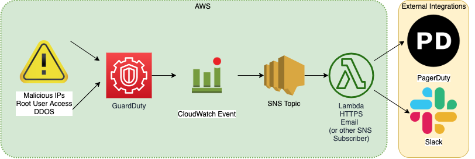

# [AWS](README.md) / Using SNS, GuardDuty, and External Integrations with AWS Organizations

Ideally our infrastructure is flawless and impenetrable, but much of our work requires us to be aware of unexpected occurrences. We rely on a system using a number of AWS resources and services such as SNS, GuardDuty, and CloudWatch with external integrations such as Slack and PagerDuty to allow us to stay alert and aware of unforeseen or suspicious activity. This primer should describe our recommended current set up and allow you to set up your own system to achieve similar results. Please familiarize yourself with [Truss' conception of AWS Organizations](aws-organizations.md) before proceeding.

Our intent is to have a system which notifies regarding GuardDuty events on two integration channels (PagerDuty and Slack), depending on the kind of alert.

<!-- mdformat-toc start --slug=github --no-anchors --maxlevel=6 --minlevel=2 -->

- [Information Flow](#information-flow)
- [GuardDuty Organizational Setup](#guardduty-organizational-setup)
- [SNS Topics](#sns-topics)
- [SNS Subscriptions](#sns-subscriptions)
  - [Special consideration for email protocol (07/2020)](#special-consideration-for-email-protocol-072020)
  - [SSM Parameters](#ssm-parameters)
- [Slack Integration](#slack-integration)
  - [Special consideration for broken lambdas (07/2020)](#special-consideration-for-broken-lambdas-072020)
- [PagerDuty Organizational Setup](#pagerduty-organizational-setup)
- [PagerDuty Integration](#pagerduty-integration)
  - [Integration](#integration)
  - [Subscription](#subscription)
- [PagerDuty Slack Integration](#pagerduty-slack-integration)
  - [Extension](#extension)
- [GuardDuty Tie-In](#guardduty-tie-in)
- [A note about root login notification](#a-note-about-root-login-notification)
- [Testing your work](#testing-your-work)
- [How to Resolve/Respond to GuardDuty Findings](#how-to-resolverespond-to-guardduty-findings)

<!-- mdformat-toc end -->

## Information Flow



## GuardDuty Organizational Setup

Using GuardDuty with AWS Organizations allows us to designate an administrative account to "roll up" all findings for member accounts, aggregating findings in one place. [This is a user guide](https://docs.aws.amazon.com/guardduty/latest/ug/guardduty_organizations.html) that may provide helpful background information, although we do this in Terraform code. You should set up a GuardDuty detector in your GuardDuty administrative account and invite all the other accounts in your organization as members. Please refer to [Truss' example of an organization account layout](https://github.com/trussworks/terraform-layout-example) for more info. Make sure to enable a GuardDuty detector in the region you will have SNS subscriptions by using the `aws_guardduty_detector` resource in your GuardDuty administrative account. Use [Truss' GuardDuty for Organizations Guide](guardduty.md) to help with the set up.

We do not suggest setting this up in your `org-root` account, as that should not be used for frequent access. Instead, set it up in whichever account you use to handle org-wide infrastructure (for this example, we'll call that `infrasec`).

The way GuardDuty fits into the org structure will likely look something like the structure below. Remember, though, you do not have to include any terraform resources for GuardDuty in member accounts.

```text
├──project-org-root
│   ├── admin-global
│   │   └── GuardDuty member account
│   └── bootstrap
└── project-id
│   ├── admin-global
│   │   └── GuardDuty member account
│   └── bootstrap
└── project-infrasec
│   ├── admin-global
│   │   └── GuardDuty Administrative account
│   └── bootstrap
```

You will need to set up a detector, designate an admin account, and create configuration with member OUs in each region you intend to use GuardDuty for.

In the org-root account:

```hcl
resource "aws_guardduty_organization_admin_account" "main" {
  depends_on = [aws_organizations_organization.main]

  admin_account_id = aws_organizations_account.infrasec.id
}
```

In the GuardDuty administrative account:

```hcl
resource "aws_guardduty_detector" "main" {
  enable = true
}

resource "aws_guardduty_organization_configuration" "main" {
  auto_enable = true
  detector_id = aws_guardduty_detector.main.id
}

resource "aws_guardduty_member" "project_environment" {
  account_id                 = aws_organizations_account.project_environment.id
  detector_id                = aws_guardduty_detector.main.id
  email                      = aws_organizations_account.project_environment.email
  invite                     = false
  disable_email_notification = true
}
```

## SNS Topics

[Here's a primer](https://docs.aws.amazon.com/sns/latest/dg/welcome.html) on how SNS works to familiarize you with vocabulary.

Set up the SNS topics. Please review [this doc](sns-topics.md) to understand the organization structure we're using.

The SNS topics and related policy documents should live in the `admin-global` stack of whichever AWS account you are using for your GuardDuty administrative account in whatever regions you're planning to set up your GuardDuty detectors in. In our example, `project-infrasec/admin-global`, `us-west-2`.

If you plan to make SNS topics outside your default region, you will need to create a provider aliased for the region and pass that to the `aws_sns_topic` resource (example below).

```hcl
data "aws_iam_policy_document" "team_notification_region_policy" {
  policy_id = "__default_policy_ID"

  statement {
    sid = "general_policy"

    actions = [
      "sns:Subscribe",
      "sns:SetTopicAttributes",
      "sns:RemovePermission",
      "sns:Receive",
      "sns:Publish",
      "sns:ListSubscriptionsByTopic",
      "sns:GetTopicAttributes",
      "sns:DeleteTopic",
      "sns:AddPermission"
    ]

    condition {
      test     = "StringEquals"
      variable = "AWS:SourceOwner"

      values = [
        "${data.aws_caller_identity.current.account_id}",
      ]
    }

    effect = "Allow"

    principals {
      type        = "AWS"
      identifiers = ["*"]
    }

    resources = [
      "arn:aws:sns:region:${data.aws_caller_identity.current.account_id}:team-notification",
    ]

  }

  statement {
    sid = "allow_cw"
    actions = [
      "sns:Publish",
    ]

    effect = "Allow"

    principals {
      type        = "Service"
      identifiers = ["events.amazonaws.com"]
    }

    resources = [
      "arn:aws:sns:region:${data.aws_caller_identity.current.account_id}:team-notification",
    ]

  }
}

resource "aws_sns_topic" "team_notification_region" {
  name     = "team-notification"
  provider = aws.region
  policy   = data.aws_iam_policy_document.team_notification_region_policy.json
}
```

## SNS Subscriptions

Each SNS topic should have one or more subscriptions. There are a [number of protocols](https://docs.aws.amazon.com/sns/latest/api/API_Subscribe.html) that can be used for a subscription endpoint. Our setup uses Email, HTTPS, and Lambda protocols.

We set up these subscriptions in a number of ways, depending on the integration. If you are using the model of SNS Topics indicated above, your alert topic will have 2 subscriptions (Slack and PagerDuty), while your notification topic will have just 1 (Slack).

### Special consideration for email protocol (07/2020)

Terraform doesn't support email protocol, so any subscription to email will be set up manually. We do record these as commented out terraform code in our repos.

### SSM Parameters

To integrate with PagerDuty and Slack, you will need to generate API keys. For Slack, you'll have to set up an [incoming webhook](https://my.slack.com/services/new/incoming-webhook/). With PagerDuty, you'll have to [create an API key](https://support.pagerduty.com/docs/generating-api-keys).

We recommend storing these keys in [SSM Parameter Store](https://docs.aws.amazon.com/systems-manager/latest/userguide/systems-manager-parameter-store.html) as secure strings. We prefix our keys with the stacks they live since there may be more than one key per account. Then you can refer to them in your code without revealing their contents:

```hcl
data "aws_ssm_parameter" "pagerduty_api_key" {
  name = "admin_global/pagerduty_api_key"
}
```

## Slack Integration

We use this [notify-slack module](https://registry.terraform.io/modules/terraform-aws-modules/notify-slack/aws). It allows you to either create or pass in an SNS topic and then creates an AWS Lambda to send Slack notifications. Our implementation favors creating SNS topics on our own so we can set the topics' policies. Create an instance of this module for each of the topics you have created that you want to use for a Slack notification, in each region and account you want that topic and notification to exist. Since we're using GuardDuty with Organizations, we're expecting GuardDuty incidents to bubble up to the `orgname-infrasec` account. That means that for GuardDuty, we only need to set up the slack integration in that delegated administrator account.

```hcl

module "slack_team_notification_region" {
  providers = {
    aws  = aws.region
    null = null
  }

  source  = "terraform-aws-modules/notify-slack/aws"
  version = "~> 3.0.0"

  lambda_function_name = local.region_team_notification_lambda_function_name
  create_sns_topic     = false
  sns_topic_name       = local.region_team_notification_sns_topic_name

  slack_webhook_url = data.aws_ssm_parameter.slack_webhook.value
  slack_username    = local.region_team_notification_username
  slack_channel     = local.region_team_notification_channel
}
```

### Special consideration for broken lambdas (07/2020)

If a lambda is broken, it cannot self-report the break. This is relevant for this set up because we use the `notify-slack` module, which includes a lambda. We get around this issue by making a "failover" SNS topic in each region of interest. We create a `aws_cloudwatch_metric_alarm` to report when the lambda itself fails. You should make an instance of this alarm for every instance of the `notify-slack` module (or other lambdas).

```hcl
resource "aws_cloudwatch_metric_alarm" "slack_team_notification_region_error" {
  provider = aws.region

  alarm_name        = "slack-team-notification-region-error"
  alarm_description = "This metric monitors lambda invocation failures"

  comparison_operator = "GreaterThanOrEqualToThreshold"
  evaluation_periods  = "2"
  metric_name         = "Errors"
  namespace           = "notify-slack-notifications"
  period              = "300"
  statistic           = "Average"
  threshold           = "1"

  alarm_actions = [aws_sns_topic.failover_region.arn]
}
```

## PagerDuty Organizational Setup

Using PagerDuty with AWS Organizations allows us to set organization-wide service schedules, escalation policies, and users. These resources will live in a PagerDuty stack in your organizational infrastructure account. You will need to create an API key to use anywhere you are implementing a PagerDuty provider. You can do this in the PagerDuty console and store it in the appropriate AWS account's parameter store.

## PagerDuty Integration

Once you have created those resources, you can create a PagerDuty provider to create resources on PagerDuty. You'll refer to your `pagerduty_api_key` that you stored in Parameter Store here.

```hcl
provider "pagerduty" {
  version = "~> 1.7.4"
  token   = data.aws_ssm_parameter.pagerduty_api_key.value
}
```

Once you have a PagerDuty provider, you can create PagerDuty services for each unit you want alerts on. We decided to split by team--so there is a service for the app team and one for the infra team. Be aware: you do not need a service for each AWS account! You should keep the `pagerduty_service_integration` resources in the same place as you put the the PagerDuty team services.

Create a `pagerduty_service_integration` for each of the AWS services you'd like to get PagerDuty alerts on. In this case, we have set up integrations for CloudWatch and of course, GuardDuty. Once you have created those integrations, you should create `aws_sns_topic_subscription` linking the subscription endpoint to the service integration you just set up. This will read something like `"https://events.pagerduty.com/integration/${pagerduty_service_integration.guardduty.integration_key}/enqueue"`. You will only have these in the AWS account where you expect alerts to go off--your GuardDuty designated admin account (i.e. `orgname-infrasec`). Only add subscriptions elsewhere if you have other integration alerts such as CloudWatch.

### Integration

```hcl
data "pagerduty_vendor" "guardduty" {
  name = "GuardDuty"
}

resource "pagerduty_service_integration" "guardduty" {
  name    = "GuardDuty - team env cloud"
  service = pagerduty_service.team_account.id
  vendor  = data.pagerduty_vendor.guardduty.id
}
```

### Subscription

```hcl
resource "aws_sns_topic_subscription" "guardduty_team_notification_region" {
  provider = aws.region

  topic_arn              = "arn:aws:sns:region:${data.aws_caller_identity.current.account_id}:sns_topic_name"
  protocol               = "https"
  endpoint               = "https://events.pagerduty.com/integration/${pagerduty_service_integration.guardduty.integration_key}/enqueue"
  endpoint_auto_confirms = true
}
```

## PagerDuty Slack Integration

You may also want PagerDuty to integrate with Slack, in order to create alerts from PagerDuty incidents on Slack and allow users to Acknowledge and Resolve incidents from Slack itself. You will most likely only create one extension per service, so we recommend putting them wherever the service is created.

### Extension

```hcl

## Slack extension integration with pagerduty for app level alerts
data "pagerduty_extension_schema" "slack-v2" {
  name = "Slack V2"
}

resource "pagerduty_extension" "slack-v2-service" {
  name = "slack v2 - team"

  extension_schema  = data.pagerduty_extension_schema.slack-v2.id
  extension_objects = [pagerduty_service.team_account.id]

  # Ignore this configuration as the actual authorization must be done manually.
  # See manual operations log in the README for details
  config = null
  lifecycle {
    ignore_changes = [config]
  }
}
```

You're not quite done yet. PagerDuty does not actually authorize the link between the extension and Slack until you manually create it. Sign into PagerDuty and [visit the extensions page](https://movemil.pagerduty.com/extensions). Locate your new extension in the Service Extensions table and click on the gear button on the bottom right of the far-right Details cell for your extension. Select either the Re-authorize/Authorize or Edit option (they do the same thing) from the drop-down. Scroll down and select the channel you prefer under `Where should PagerDuty post?` then click "Allow". You should see a notification appear in the channel you've selected in Slack that says "\[your name\] added an integration to this channel: PagerDuty". Make sure to record that you've done this in your Manual Operations log. Note: You only need to create one extension per service rather than per environment.

## GuardDuty Tie-In

At this point, you have SNS topics, notify-slack lambdas and therefore Slack subscriptions, PagerDuty subscriptions, and a Slack-PagerDuty extension. The final step is to tie everything to GuardDuty, the source of all these alerts!

Given that you have set up outside integrations, you will likely want to use the [TrussWorks GuardDuty Notifications](https://registry.terraform.io/modules/trussworks/guardduty-notifications/aws) module. This module allows you to create the CloudWatch event targets for the SNS topic you are using for PagerDuty notifications and the SNS topic you are using for Slack notifications. These must be two separate topics, as they are formatted differently. Given [this setup](sns-topics.md), we used the `team-type-notification` SNS topic for Slack and the `team-type-alert` topic for PagerDuty. Note, this assumes you've already enabled a GuardDuty detector in the region with your SNS topics. You will need to implement an instance of the `guardduty_notifications` module for each region you expect to receive GuardDuty notifications from.

```hcl
module "guardduty_notifications" {
  source  = "trussworks/guardduty-notifications/aws"
  version = "3.0.1"

  sns_topic_slack     = aws_sns_topic.slack
  sns_topic_pagerduty = aws_sns_topic.pagerduty
}
```

## A note about root login notification

We've taken care to manage our team members' account access to avoid root users. So if someone is logging into accounts as a root user, we want a notification. We can only set alerts for this scenario in `us-east-1` because that is the default region on root login. Therefore, we replicate the SNS topics and subscriptions that we might otherwise only have in *our* default region in `us-east-1` to enable this notification flow. [Here's a helpful reader about this scenario from AWS](https://aws.amazon.com/blogs/mt/monitor-and-notify-on-aws-account-root-user-activity/).

## Testing your work

Once you've done all of this set up, you'll want to test your work! GuardDuty is a black box, but there's an easy way to generate findings by using AWS' [`create-sample-findings`](https://awscli.amazonaws.com/v2/documentation/api/latest/reference/guardduty/create-sample-findings.html) command. First figure out the detector ID for your current account by using [`list-detectors`](https://awscli.amazonaws.com/v2/documentation/api/latest/reference/guardduty/list-detectors.html). Then create a sample finding for that detector. Detectors and the `create-sample-finding` command will both be region-specific. You will likely want to generate just one finding at a time. You can find the [finding types here](https://docs.aws.amazon.com/guardduty/latest/ug/guardduty_finding-types-active.html). Create a sample finding in each member account and each region of interest. These findings will appear both in the account in which they were created AND in the GuardDuty administrative account you've designated. The finding will create a notification in Slack and a PagerDuty incident, which will also notify in Slack.

```bash
aws guardduty list-detectors --region us-east-1
aws guardduty create-sample-findings --detector-id XXXXXXXXXXXXXXXXXX --region us-east-1 --finding-types PrivilegeEscalation:IAMUser/AdministrativePermissions
```

## How to Resolve/Respond to GuardDuty Findings

When an alert occurs and you are notified via PagerDuty or Slack, you'll have to respond.

1. Immediately Acknowledge the finding, which you can do via the PagerDuty app, website, or Slack integration.
1. Once you've found a resolution for the incident, you should Resolve it (which again you can do via app, site, or on Slack).
1. Archive the relevant GuardDuty finding using the AWS Console. Because you've set your `infrasec` as the administrative account for GuardDuty, all  findings for member accounts "roll up" there. Depending on whether the alerts are in the GovCloud or Commercial space, that will be either the `project-com-infrasec` or `project-gov-infrasec` account. Make sure you are in the correct region (either `us-west-2` or `us-east-1`, depending on where the alert fired). Confirm the alert you are archiving fired in the account you expected by checking the `Account ID` column in the Findings table.
