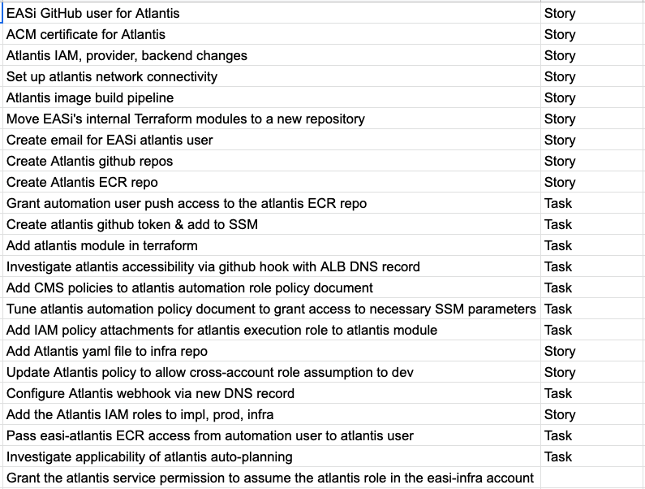
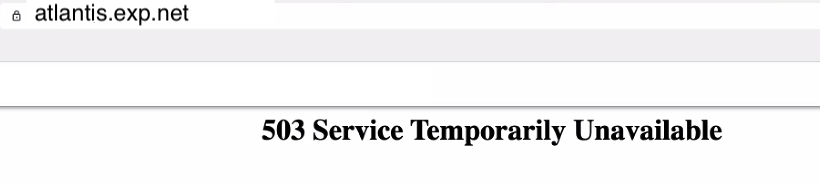
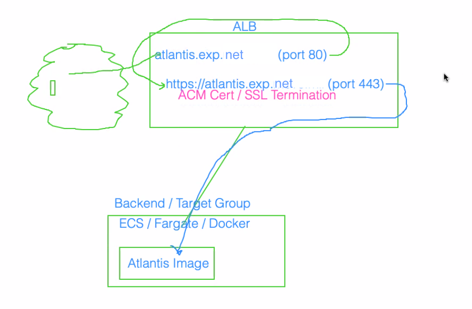
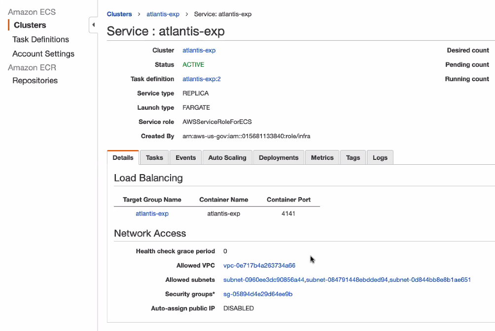
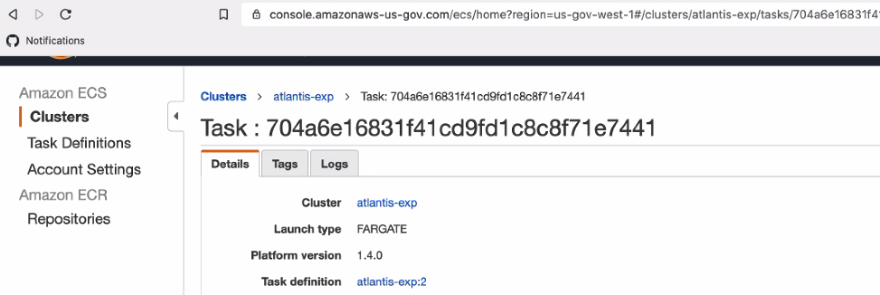
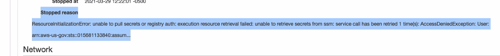
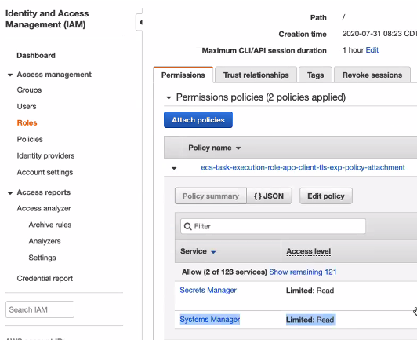
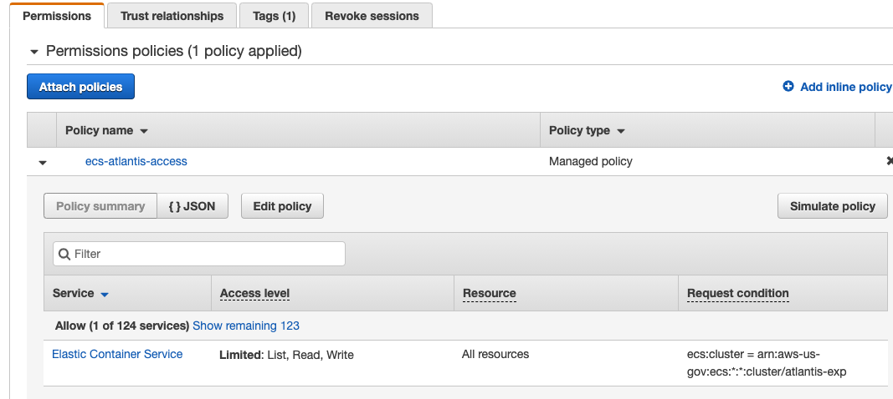

# [Terraform](README.md) / Atlantis

## Step-by-Step Atlantis Implementation

### Where to start

First off, there are [3 ways to configure Atlantis](https://www.runatlantis.io/docs/configuring-atlantis.html). Step one is looking at your own configuration and deciding which way to implement your Atlantis server. The [Atlantis docs](https://www.runatlantis.io/docs/server-configuration.html) summarize our options:

```text
Configuration to atlantis server can be specified via command line flags, environment variables, a config file or a mix of the three.
```

In the [legendary waddle](https://github.com/trussworks/legendary-waddle) repo, for example, we used a combination of [environment variables](https://github.com/trussworks/legendary-waddle/blob/master/trussworks-prod/atlantis-prod/main.tf#L85-L102) and [repo-level `atlantis.yaml` files](https://github.com/trussworks/legendary-waddle/blob/master/atlantis.yaml).

In deciding how to implement Atlantis in your project's context, let's first take a moment to step back and remind ourselves what Atlantis is and what it does.

Atlantis is ["a simple Go app. It receives webhooks from your Git host and executes Terraform commands locally."](https://www.runatlantis.io/docs/deployment.html#architecture-overview) It's high-level infrastructure middleware.

We'll be calling the [Atlantis Fargate module](https://tf-registry.herokuapp.com/modules/terraform-aws-modules/atlantis/aws/latest) to create the resources we need to deploy Atlantis. As you can see in the documentation, this module leverages the following resources in your code:

- Virtual Private Cloud (VPC)
- SSL certificate using Amazon Certificate Manager (ACM)
- Application Load Balancer (ALB)
- Domain name using AWS Route53 which points to ALB
- AWS Elastic Cloud Service (ECS) and AWS Fargate running Atlantis Docker image
- AWS Parameter Store to keep secrets and access them in ECS task natively

If you've already got some of these resources created on your project, the module expects you to integrate them. If the resources don't exist, the module (and submodules) will create those resources for you. Figuring out which of your project's pre-existing resources to integrate, and then which resources you should leverage the module's calls to create is the first step. Here's a rough whiteboarded visual of the process. Some call it art:


The next step is to figure out _the order in which to create the resources you need_ so as to avoid/minimize interdependency resource conflicts with the pre-existing resources you are integrating. The order of operations for the latter is what makes implementing Atlantis a bit tricky, especially if you're not familiar with ways to troubleshoot the resources the Atlantis module creates.

As a good example, here are the tickets Ryan & Josh used on EASi in planning/implementing Atlantis:



### Make sure you have an email

Make sure you've got an email you can associate with Atlantis to recieve notifications, etc. In our case, we can associate our pre-existing `dp3.us` email address and use `dp3-integrations+atlantis@truss.works` to associate with our Atlantis user.

### Step 1: Generate a GitHub Deploy Key

Generate a new SSH key per [GitHub's documentation](https://docs.github.com/en/github/authenticating-to-github/generating-a-new-ssh-key-and-adding-it-to-the-ssh-agent#generating-a-new-ssh-key).
Next, add the key as a [Deploy Key](https://docs.github.com/en/developers/overview/managing-deploy-keys#deploy-keys), following GitHub Docs. As you can see, the first step in the setup is to "Run the `ssh-keygen` procedure" on your server, which you did in the previous step. Note that the act of adding the deploy key is done in the GUI for the repo associated with the location you'd like to deploy Atlantis in. In our case, we're in `transcom/transcom-infrasec-gov` because we're deploying to the `exp` account first. Go to the repo and click on Settings, then "Deploy keys". You'll click the box to "Allow write access."

`cat` your `id_ed25519.pub` to see your public key. It will look something like `ssh-ed25519 AAAAC3NzaC1lZDI1NTE5AAAAIErcI6OvZmjDqdzucoaLEndRx2DWfPVUKR9aF27ijH6V dp3-integrations+atlantis@truss.works`
After you add the deploy key to GitHub, you should get an automated email to confirm the key was added.

### Step 1.5: Store the Key in AWS SSM

Log into the console for the account you want to deploy Atlantis in the correct location (in our case, `transcom-gov-milmove-exp`), and add your key to AWS Systems Manager > Parameter Store with the name `/atlantis-global/atlantis_key` as type `SecureString`, using "My current account" as the KMS key source.

### Step 2: Set up Docker

Because we use already use our own base Docker image on MilMove, we're continuing the established pattern to deploy Atlantis. We'll create a docker image for Atlantis and put that image in ECR with all our other images. Next, we can create (and define) an ECS task to retrieve our Atlantis image from ECR. This way, we can require our Atlantis user to operate using our specific desired conditions.

The module creates the task and the role.

Make a dockerfile that runs inside the base circleci image. You'll need to install Terraform and Atlantis. Because our setup requires us to run docker-in-docker, you'll need to run the install as `USER root`, and then switch back to `USER circleci` after the install to be compatible with our base image.
See [this PR](https://github.com/transcom/circleci-docker/pull/98) for the implementation.

If you do not set the `atlantis_image` variable, you'll find `atlantis:latest` is used by default. This default is not recognized as updated when a new "latest" is released due to the word remaining unchanged. Therefore, we recommend you pass in a numbered version of the Atlantis docker image to the `atlantis_image` var.

### Add the Atlantis bucket and iam role

Create an `atlantis-global` directory in your desired account:
`mkdir -p transcom-gov-milmove-exp/atlantis-global`

BUCKET: Add the bucket, version, and provider files following the steps (more or less) done in the bootstrapping document in [the Atlantis section](https://github.com/trussworks/legendary-waddle/blob/master/docs/how-to/bootstrap-new-aws-account.md#atlantis).

IAM role: Add the IAM role. TODO: add note explaining why we do this differently from circleci (and need only roles but not a user). At this point you can go ahead and add the `atlantis.yaml` with a list of directories Atlantis needs to access, and [update the PR](https://github.com/transcom/transcom-infrasec-gov/pull/275) template to include the new directory.

### Add & validate a certificate for Atlantis

Add a certificate to ACM, which [manages our certificates for us](https://github.com/transcom/transcom-infrasec-gov/pull/279).

You will need to find the `arn` to plug it into the [atlantis module](https://registry.terraform.io/modules/terraform-aws-modules/atlantis/aws/latest) you'll call in the next step. You can find this in the console's Certificate Manager after merging the PR to add the certificate.


Because of AWS tomfoolery, we have to validate the cert in a different location. See this PR for [where we're validating the certs we create](https://github.com/transcom/transcom-infrasec-com/pull/1397).

### Call the [Atlantis module](https://registry.terraform.io/modules/terraform-aws-modules/atlantis/aws/latest)

In a PR that [looks like this](https://github.com/transcom/transcom-infrasec-gov/pull/277).

Which you will need to either use `-target` to apply or apply several times to create resources in an order that respects their interdependency.

You'll also need to add the code to pull in the token like so:

```hcl
data "aws_ssm_parameter" "github_user_token" {
  name = "/atlantis-global/atlantis_key"
}
```

Here's how we check what we made in the console, with a few corresponding troubleshooting steps:

### Cert Drama

We want to see a `503` like so:


If you get a cert error (wrong cert) when you look at `atlantis.exp.move.mil`

ex:


Check the records and corresponding IP addresses in the terminal using `dig move.mil` and `host atlantis.move.mil` to pull up your ACM associated values. Here we also check `orders.exp.move.mil` (corresponding to our misaligned certificate), but it looks similar to this:


We can also look at this in Route 53 > Hosted zones check record name --> and look at the `Value/Route traffic to` column. The value should not be going to an IP, it should be going to a CNAME.

We troubleshoot by logging into the console, looking at your ALB, and checking what's associated with it:
EC2 > load balancer > `atlantis-exp`


Click on your cert and do a manual hack to point to the load balancer.

(**TODO**: don't forget to import notes from the PR into here, specifically that part where I had to use subnet ids instead of straight up string values for the subnets)

### ALB Drama

You'll see two ALB listeners in the plan related to the redirect on the ALB. Take note bc this hot mess might cause problems later:

```hcl
  # module.atlantis.module.alb.aws_lb_listener.frontend_http_tcp[0] will be created
  ...blah...blah...blah...
      + port              = 80
      + protocol          = "HTTP"
      + ssl_policy        = (known after apply)

...blah...blah...blah...{{

          + redirect {
              + host        = "#{host}"
              + path        = "/#{path}"
              + port        = "443"
              + protocol    = "HTTPS"
              + query       = "#{query}"
              + status_code = "HTTP_301"
            }
        }
    }

  # module.atlantis.module.alb.aws_lb_listener.frontend_https[0] will be created
  + resource "aws_lb_listener" "frontend_https" {
  ...blah...blah...blah...
      + port              = 443
      + protocol          = "HTTPS"
      + ssl_policy        = "ELBSecurityPolicy-2016-08"

      + default_action {
          + order            = (known after apply)
          + target_group_arn = (known after apply)
          + type             = "forward"
        }
    }
```

Check out those ports because this is what's happening:


The ALB is being created with these two listeners (one https & one tcp). The tcp port (on 80) serves to redirect to https/443 to force use of our ACM cert we created & sets up SSL termination. This keeps us from having to jump through the hoops of setting up docker and the client with certs and dealing with SSL termination the TCP way, which is much more of a PITA (and is also how we have to do it with NLBs).

Check that the Fargate instance is behind the ALB. If not you'll have to put it there manually in the console. You can do this by specifying the target group

### ECS Tasks Permissions Drama

We only had govcloud drama here. The module hard-codes `aws` as the provider but govcloud requires `aws-us-gov` to create the task policy attachment. 🤷‍♀️

Check task exists in console via ECS > Clusters > `atlantis-exp`



We can also see the task definition by clicking on the `Task definition` name



If we can see in the console that the Fargate container says `STOPPED`, we can also see the reason.



Typically this is a policy/permissions error. You can see here the only permissions we have are thw two policies needed to read our Github secrets.



To fix this in our case, we can mimic the ecs tasks in another stack. We create the policy in terraform and attach it to either the Atlantis IAM user we created or the Atlantis role. A successful poicy attachement will look like this:



### Connect the Bucket

Of all the things this module does, it **does not** create a logs bucket. The module itself has the expectation you will either create a new bucket or connect an existing one. In our example, we'll connect an existing logs bucket and ensure our permissions are correct.

Locate your existing logs bucket, presumably created using the `trussworks/logs/aws` module. We're just going to put logs in the bucket that already exists for the account, in our case `transcom-gov-milmove-exp-aws-logs`.

Once we find the code that creates the bucket, we need to give Atlantis permission to add our logs to the bucket. We do this by adding our chosen logs bucket prefix (we're following the established pattern and using `alb/atlantis-exp` here) to the `alb_logs_prefixes` and the `nlb_logs_prefixes` lists [in our existing logs bucket](https://github.com/transcom/transcom-infrasec-gov/blob/0eeba19465584e10772a9b1d1f71fb3e87d7138c/transcom-gov-milmove-exp/admin-global/main.tf#L25-L26).

After that, we seal the deal by returning to our code and adding the following code to our module call:

```hcl
alb_log_bucket_name             = "transcom-gov-milmove-exp-aws-logs"
alb_log_location_prefix         = "alb/atlantis-exp"
alb_logging_enabled             = true
alb_listener_ssl_policy_default = true
```

Another example is available in the [legendary-waddle repo](https://github.com/trussworks/legendary-waddle/blob/6b63fc65c6d2b0237a7233ad36cb9356f329966b/trussworks-prod/atlantis-prod/main.tf#L54-L56)

Then we can go into the console to check that the bucket contains the prefix path by viewing the auto-created `ELBAccessLogTestFile` under the path you indicated, in our case `alb/atlantis-exp/`:


## SSM/Parameter Store Drama

- When resetting a GitHub personal token in Parameter Store, you will have to redeploy the Atlantis instance. Otherwise, the new credential will not be updated in the instance.

## Links and other reading

- [Truss's Atlantis blog post](https://truss.works/blog/infrastructure-management-with-atlantis)
- 🔒 [Atlantis setup in Truss's commercial accounts for the prod tiers](https://github.com/trussworks/legendary-waddle)
- 🔒 [Atlantis setup in Truss's commercial accounts for the dev tiers](https://github.com/trussworks/legendary-waddle-dev)
