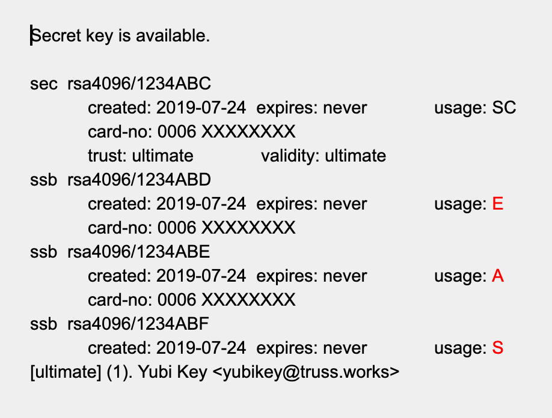
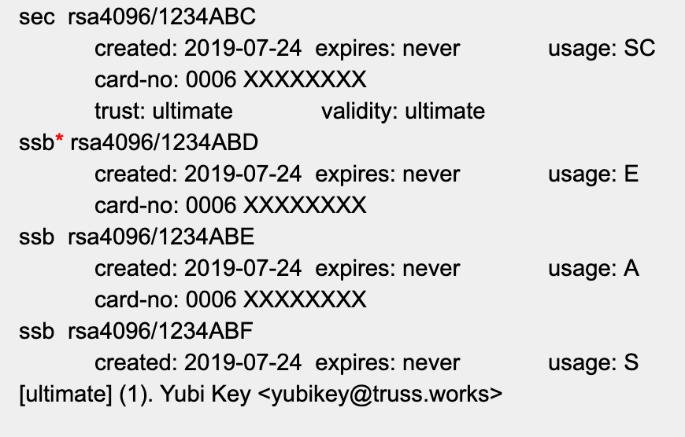

# [InfraSec](../README.md) / YubiKey Configuration Guide

<!-- toc -->

* [Introduction](#introduction)
* [Purchasing and Distribution](#purchasing-and-distribution)
* [Prerequisites](#prerequisites)
  * [Hardware Requirements](#hardware-requirements)
  * [Software Requirements](#software-requirements)
* [Configuring Your Environment](#configuring-your-environment)
  * [Using pinentry (optional)](#using-pinentry-optional)
* [Verifying Your YubiKey](#verifying-your-yubikey)
* [Setting the YubiKey User and Admin PIN codes](#setting-the-yubikey-user-and-admin-pin-codes)
* [Key Generation](#key-generation)
  * [Generating a GPG Private Key](#generating-a-gpg-private-key)
  * [Add a (S) signing subkey](#add-a-s-signing-subkey)
  * [Add an (A) authentication subkey](#add-an-a-authentication-subkey)
* [Check Your Keys](#check-your-keys)
* [Deleting a secret key](#deleting-a-secret-key)
* [Creating Backups](#creating-backups)
  * [Create a backup of your key (optional)](#create-a-backup-of-your-key-optional)
  * [Create a revocation certificate (optional)](#create-a-revocation-certificate-optional)
* [Configuring the YubiKey](#configuring-the-yubikey)
  * [Importing the keys to your YubiKey](#importing-the-keys-to-your-yubikey)
* [Adding Additional Email Addresses](#adding-additional-email-addresses)
* [Configuring SSH](#configuring-ssh)
* [Configuring git commit Signing](#configuring-git-commit-signing)
* [Configuring Github](#configuring-github)
  * [Using Github Desktop](#using-github-desktop)
* [Using The YubiKey](#using-the-yubikey)
  * [Signing git commits](#signing-git-commits)
  * [Enabling touch-only mode (optional)](#enabling-touch-only-mode-optional)
  * [Disabling OTP (One Time Password)](#disabling-otp-one-time-password)
* [GitHub Apps](#github-apps)
* [Troubleshooting](#troubleshooting)

<!-- Regenerate with "pre-commit run -a markdown-toc" -->

<!-- tocstop -->

## Introduction

The YubiKey is a hardware authentication device manufactured by Yubico that supports one-time passwords, public-key encryption and authentication, and the Universal 2nd Factor (U2F) and FIDO2 protocols developed by the FIDO Alliance. It allows users to securely log into their accounts by emitting one-time passwords or using a FIDO-based public/private key pair generated by the device. YubiKey also allows for storing static passwords for use at sites that do not support one-time passwords. Some password managers, including 1Password, support YubiKey.

The YubiKey will allow us to sign our GitHub commits, which may be required by some contracts.

If you have problems or questions during the configuration process, check in with #infrasec-chat on the Truss Slack.

PIN codes and passphrases may be cached for a short duration at any point during the configuration process. You may not always be prompted to enter these.

## Purchasing and Distribution

It is currently recommended that distributed Trussels purchase their YubiKey directly from either Amazon or [Yubico](https://www.yubico.com/store/). The SF office may opt to purchase some YubiKeys in bulk for local Trussels, but this has not been decided yet. Bulk purchasing of YubiKeys yields a savings of $2.40 per $60 YubiKey.

If ordering a YubiKey for a project, check with your project on how to categorize the expense in Expensify. Otherwise, use the `Computer Equipment` category.

You should purchase a YubiKey 5 Series ([5C](https://www.amazon.com/Yubico-YubiKey-Factor-Authentication-Security/dp/B07HBCTYP1/), [5C Nano](https://www.amazon.com/Yubico-YubiKey-Factor-Authentication-Security/dp/B07HBTBJ5S/), [5ci](https://www.amazon.com/Yubico-YubiKey-5Ci-Authentication-Connectors/dp/B07WGJ1DNJ/))

* **5Ci** supports both USB C and Lighting ports, which is good if you have an iPhone.
* **5C** and **5C Nano** only support USB C and come in different form factors.

If you have a YubiKey Series 4 or a YubiKey 5 NEO, you _should_ upgrade to a 5 Series, unless you have a specific need for the older model. The YubiKey 5 series will provide stronger security and can support larger encryption keys.

## Prerequisites

### Hardware Requirements

* YubiKey 5 Series ([5C](https://www.amazon.com/Yubico-YubiKey-Factor-Authentication-Security/dp/B07HBCTYP1/), [5C Nano](https://www.amazon.com/Yubico-YubiKey-Factor-Authentication-Security/dp/B07HBTBJ5S/), [5ci](https://www.amazon.com/Yubico-YubiKey-5Ci-Authentication-Connectors/dp/B07WGJ1DNJ/))
* YubiKey 4 Series and 5 NEO are acceptable, but not preferred. Keys are limited to 2048 bits

_FIPS based YubiKeys ship with security vulnerabilities. Do not purchase a FIPS based YubiKey for work performed at Truss. FIPS YubiKey models are specifically called YubiKey FIPS and not part of the 5 series listed above._

[Yubico Security Advisory](https://www.yubico.com/support/security-advisories/ysa-2019-02/) about FIPS keys

### Software Requirements

* brew
  * ykman
  * ykpers
* brew cask
  * gpg-suite-no-mail

Configure your environment with:

```console
brew install ykman ykpers
brew cask install gpg-suite-no-mail
````

If xcode is not up to date, you will be prompted to install it with: `xcode-select --install`

## Configuring Your Environment

Enable SSH support by default when launching gpg-agent:

```bash
echo enable-ssh-support >> ~/.gnupg/gpg-agent.conf
```

Add the following to your shell profile `.bashrc`, `.zshrc`, etc.

```bash
# Enable SSH Key on YubiKey Device
killall gpg-agent
killall ssh-agent
eval $(gpg-agent --daemon)

export GPG_TTY=$(tty)
```

In the future, if you receive the message `No matching processes
belonging to you were found` after running `source ~/.bashrc`, this is
not necessarily an error message. It may just mean you’re not
currently running the processes associated with this change.

### Using pinentry (optional)

Instead of prompting you in a terminal, you can have gpg-agent use an
external program.  This might be useful if you want to use your editor
for commits.

```console
brew install pinentry-mac
echo 'pinentry-program /usr/local/bin/pinentry-mac' >> \
    ~/.gnupg/gpg-agent.conf
gpgconf --kill gpg-agent
gpg-agent --daemon
```

If you use this, you do not need to set `GPG_TTY`.

## Verifying Your YubiKey

To verify a YubiKey is genuine, open a [browser with U2F support](https://support.yubico.com/support/solutions/articles/15000009591-how-to-confirm-your-yubico-device-is-genuine-with-u2f) to <https://www.yubico.com/genuine/>. (Chrome, FireFox and Safari work). Insert a Yubico device, and select Verify Device to begin the process. Touch the YubiKey when prompted, and if asked, allow it to see the make and model of the device. If you see Verification complete, the device is authentic.

This website verifies the YubiKey's device attestation certificates signed by a set of Yubico CAs, and helps mitigate [supply chain attacks](https://media.defcon.org/DEF%20CON%2025/DEF%20CON%2025%20presentations/DEF%20CON%2025%20-%20r00killah-and-securelyfitz-Secure-Tokin-and-Doobiekeys.pdf).

## Setting the YubiKey User and Admin PIN codes

The YubiKey ships with a default User PIN of `123456` and a default Admin PIN of `12345678`. For security purposes, these PIN codes must be changed before use.

The User PIN is the PIN that will be used on a daily basis when signing commits or authenticating. The Admin PIN is used to make changes to the YubiKey itself, such as when enabling or disabling touch-mode.

1. Insert your YubiKey into the USB port.
1. Enter the command: `gpg --card-edit`
1. Enter the command: `admin`
1. Enter the command: `passwd`
1. To change the Admin PIN enter: `3`
1. Enter the default PIN of `12345678`
1. Enter your new 8 digit Admin PIN, add it to 1Password, and confirm it.
1. To change the User PIN enter: `1`
1. Enter the default PIN of `123456`
1. Enter your new 6 digit User PIN, add it to 1Password, and confirm it.
1. Enter the command: `q`
1. Enter the command: `name`
1. Enter your surname and given name (these should match the name provided when you generate your certificate)
1. Enter the command `q` to exit the admin menu

If at any point you make a mistake and need to reset your YubiKey PIN(s), you can do so with the command: `ykman openpgp reset`

## Key Generation

### Generating a GPG Private Key

This will generate the secret key.

1. Enter the GPG command: `gpg --expert --full-gen-key`
1. When prompted to specify the key type, enter 1 (for "RSA and RSA (Default)") and press Enter
1. Specify the size of key you want to generate. This key size will also apply to subkey size. Do one of the following:
   * For a YubiKey 4 series, enter 2048 and press Enter
   * For a YubiKey 5 series, enter 4096 and press Enter
1. Specify an indefinite expiration date of the key by pressing press Enter. Verify the expiration date when prompted
1. Now you will enter your user information. Enter your Real Name and press Enter. Be sure to enter both your first and last name
1. Enter your `@truss.works` Email Address and press Enter. If you do not perform commits with your @truss.works email address, we’ll add your GitHub email address to the key in a later step.
1. If desired, enter a Comment about this key (e.g., “work”), and press Enter. (To leave the comment blank, just press Enter)
1. Review the information you entered, make any changes if necessary. If all information is correct, enter O (for Okay) and press Enter
1. A dialog box is displayed so you can enter the passphrase for your key. While the key is being generated, move your mouse around or type on the keyboard to gain enough entropy. When the key has been generated, you will see several messages displayed. Make a note of the key ID, that is displayed in the message such as `gpg: key 1234ABC marked as ultimately trusted`. The key ID in this case is 1234ABC and you will need this key ID to perform other operations.

If at any point you forget the key ID, enter `gpg --list-signatures` to display it.

It’s time to add the subkeys. Some of these may already be created. You can check what’s been created by checking your keys.

### Add a (S) signing subkey

This will be used for git commit and tag signing.

1. Enter the GPG command: `gpg --expert --edit-key 1234ABC` (where 1234ABC is the key ID of your key)
1. Enter the command: `addkey`
1. You are prompted to specify the type of key. Enter 4 for RSA (sign only)
1. Specify the size of the key that you want to generate. Do one of the following:
   * For a YubiKey 4 series, enter 2048 and press Enter
   * For a YubiKey 5 series, enter 4096 and press Enter
1. Specify the expiration of the authentication key (this should be the same expiration as the key). Unless you have a specific need, this should be set to indefinite
1. When prompted to save your changes, enter y (yes)
   * If prompted to replace the existing key, select no.
1. Enter the passphrase for the key. Note that this is the passphrase, and not the User PIN or Admin PIN

### Add an (A) authentication subkey

This subkey will be used to pull private git repos via SSH and may be used to authenticate to any SSH host.

1. Enter the GPG command: `gpg --expert --edit-key 1234ABC` (where 1234ABC is the key ID of your key)
1. Enter the command: `addkey`
1. You are prompted to specify the type of key. Enter 8 for RSA
1. To add an authentication key, toggle all options until Authenticate is the only selection, and then Q if you are finished.

   This is interface has a unique design where you need to toggle things on and off to get the desired result.
   The default state shows **Sign Encrypt** active.

   

   Enter `A` to enable **Authenticate**. Enter `E` and `S` (separately) to disable **Sign** and **Encrypt**.

   

1. Hit `Q` to finish.
1. Specify the size of the key that you want to generate. Do one of the following:
   * For a YubiKey 4 series, enter 2048 and press Enter
   * For a YubiKey 5 series, enter 4096 and press Enter
1. Specify the expiration of the authentication key (this should be the same expiration as the key). Unless you have a specific need, this should be set to indefinite
1. When prompted to save your changes, enter y (yes)
   * If prompted to replace the existing key, select no.
1. Enter the passphrase for the key. Note that this is the passphrase, and not the User PIN or Admin PIN

## Check Your Keys

After adding the subkeys, enter the GPG command: `gpg --expert --edit-key 1234ABC` (where 1234ABC is the key ID of your key)

The optimal output should look similar to this, showing an individual subkey for **E (Encrypt)**, **A (Authenticate)**, and **S (Sign)** in the YubiKey keychain.



## Deleting a secret key

If you add one too many keys, you can delete them.

1. Enter the GPG command: `gpg --edit-key 1234ABC` (where 1234ABC is the key ID of your key)
1. Enter `key 1` (This will select the first key but you can select any key)
1. After pressing enter an _asterisk_ will appear next to that key
1. Enter the command: `delkey`
1. It will then ask if you want to delete the key. Select yes
1. Enter your passphrase
1. Verify the key is deleted
1. Repeat if multiple keys need to be deleted

_Note that if you have not imported the keys to your YubiKey yet then your output will not include those card-no details._

## Creating Backups

These steps are optional and will help to configure a new YubiKey should yours become lost or damaged. While you could start from scratch, and should in some cases, this will provide the quickest path to recovery.

### Create a backup of your key (optional)

This will create a backup of the secret key and subkeys.

1. Insert the YubiKey into the USB port
1. Enter the GPG command: `gpg --export-secret-key --armor 1234ABC >> /path/to/secret.key` (where 1234ABC is the key ID of your key)
1. Enter the GPG command: `gpg --export-secret-subkeys >> /path/to/secret.sub.key --armor 1234ABC` (where 1234ABC is the key ID of your key)
1. Store these files in 1Password and delete them from your system.

### Create a revocation certificate (optional)

This will allow you to revoke the key should your secret key becomes lost or compromised. This step is not required in our current use case because we’re not uploading our certificates to a public keyserver. This may be required for future use at some point, so we’ll leave this in place for the time being.

1. Enter the command: `gpg --gen-revoke 1234ABC > 1234ABC-revoke-cert.asc` (where 1234ABC is the key ID of your key)
1. Enter the command: `Y`
1. Select a reason for revocation. The reason really doesn’t matter for our use case. I usually select 3 = Key is no longer used
1. Enter an optional description, or hit enter to continue. This field is not important.
1. Enter the command: `Y`
1. Store this file in 1Password and delete it from your system.

## Configuring the YubiKey

### Importing the keys to your YubiKey

This will _destructively_ move the secret key as well as the three subkeys to the YubiKey from the local keystore, via the `keytocard` command. In this case, _destructively_ is a good thing because it will require the YubiKey to be inserted to perform any of these functions.

1. Insert the YubiKey into the USB port
1. Enter the GPG command: `gpg --edit-key 1234ABC` (where 1234ABC is the key ID of your key)
1. Enter the command: `toggle` to switch to the public key listing (there will be no visible output)
1. Enter the command: `key 1` (to select subkey 1)

   _The interface is not intuitive here. Typing `key 1` will select the first subkey (ssb). An * next to the key will indicate that it has been selected:_

   

1. Enter the command: `keytocard`
1. When prompted where to store the key, select `2`. This will move the _encryption_ subkey to the YubiKey
1. Enter the command: `key 1` (to deselect subkey 1)
1. Enter the command: `key 2` (to select subkey 2)
1. Enter the command: `keytocard`
1. When prompted where to store the key, select 1. This will move the _signing_ subkey to the YubiKey
1. Enter the command: `key 2` (to deselect subkey 2)
1. Enter the command: `key 3` (to select subkey 3)
1. Enter the command: `keytocard`
1. When prompted where to store the key, select 3. This will move the _authentication_ subkey to the YubiKey
1. Enter the command: `save` to save the configuration and exit to the CLI.

## Adding Additional Email Addresses

1. Insert the YubiKey into the USB port
1. Enter the GPG command: `gpg --expert --edit-key 1234ABC` (where 1234ABC is the key ID of your key)
1. Enter the command: `adduid`
1. Enter your Name
1. Enter the Additional Email Address
1. Enter a comment if desired
1. Enter (`O`)kay
1. Enter your PIN if prompted
1. Enter the command: `quit`
1. When prompted to save your changes, enter y (yes). You have now saved the additional email address to your YubiKey

## Configuring SSH

1. Insert the YubiKey into the USB port
1. Configure your environment
1. Enter the GPG command: `gpg --export-ssh-key 1234ABC` (where 1234ABC is the key ID of your key)
1. This will return a string that begins with: ssh-rsa and ends with openpgp:0x1234ABC
1. To use this key to push to GitHub, copy this key into your [GitHub account](https://github.com/settings/keys). If you need to use it to SSH directly into a host, you will need to add it to an authorized-keys file.
1. Verify the SSH key with the command: ssh-add -L
1. This should verify that the SSH key is available on your yubikey. If the string ends in `cardno:000YXXXXXXXX`, then it is on the YubiKey.
1. Restart the SSH services if necessary with the following commands: source ~/.bash_profile or  source ~/.bashrc
1. When connecting via SSH, you should be prompted for your YubiKey User PIN
   * On first use, it may also prompt for the YubiKey passphrase.

## Configuring git commit Signing

1. Insert the YubiKey into the USB port
1. Enter the GPG command: `gpg --export --armor 1234ABC` (where 1234ABC is the key ID of your secret key)
1. This will export your public key, which is derived from the secret key. Copy this entire key including the lines:

   ```plaintext
   -----BEGIN PGP PUBLIC KEY BLOCK-----

   -----END PGP PUBLIC KEY BLOCK-----
   ```

1. Add this key into GitHub
1. Add the key into your git config with the following command: `git config --global user.signingkey 1234ABC` (where 1234ABC is the key ID of your key)
1. Add your name to your git config with the following command: `git config --global user.name “your name”` (this should match the name provided when you generate your certificate)
1. Add your email to your git config with the following command: `git config --global user.email youremail@truss.works` (this should match the email that you push commits with)
1. Configure Git client to always sign commits: `git config --global commit.gpgsign true`

## Configuring Github

_This step is not sequential and is linked in previous steps. If you’ve reached this point in the document, you should have already completed this._

1. Sign into the GitHub web interface
1. Click on the user icon in the upper right hand corner and select settings
1. Select SSH and PGP Keys
1. Add an SSH Key and enter the value generated in Configuring SSH
1. Add a new GPG Key and enter the value generated in Configuring git signing

### Using Github Desktop

1. echo no-tty >> ~/.gnupg/gpg.conf
1. Specify GPG path for clients: `git config --global gpg.program /usr/local/bin/gpg`

## Using The YubiKey

### Signing git commits

1. Insert the YubiKey into the USB port
1. To manually sign a git commit (commits should already be signed automatically if you've enabled it in your git config):

   ```console
   $ git commit -a -S -m 'Fixed a small undocumented procedure that made foo crash'
   ```

1. To manually sign a git tag:

   ```console
   $ git tag foo-1.0 -s -m 'Release 1.0 of foo'
   ```

1. When signing, you should be prompted to enter your YubiKey User PIN
1. If you’ve enabled touch mode, touch the YubiKey to complete the operation

### Enabling touch-only mode (optional)

It is possible that your YubiKey could be activated by malware on your machine, which could conceivably use a keylogger to capture your PIN and use that information to automatically sign commits and tags when you're not aware.

If enabling touch-only mode, it is recommended to perform this step after you’ve confirmed that everything else is working.

1. Enter the command: `ykman openpgp set-touch aut on`
1. Enter: `yes`
1. Enter the 8 digit Admin PIN to confirm the setting change

NOTE: When touch mode is enabled, operations will appear to stall. This is the only prompt that you will receive to touch your YubiKey. Failure to touch the YubiKey for authentication will result in failure of the operation. You can also disable touch-only mode with the following command: `ykman openpgp set-touch aut off`

### Disabling OTP (One Time Password)

Disabling the OTP is possible using the YubiKey Manager, and does not affect any other functionality of the YubiKey.

A side effect of the YubiKey is the Yubisneeze. The YubiKey will generate and paste a password to your screen nearly every time that you touch it.

1. Insert the YubiKey into the USB port
1. Enter the command: `ykman config usb --disable otp`
1. Enter the command: `Y` to confirm

To re-enable otp, use the command: `ykman config usb --enable otp`

## GitHub Apps

GitHub Desktop does not support commit signing. In fact, it appears that GitHub wants to keep it this way. That said, if GitHub is configured with your keys correctly, GitHub Desktop may respect your settings and sign commits. We’re still testing this.

Gitkraken directly [supports](https://support.gitkraken.com/git-workflows-and-extensions/commit-signing-with-gpg/) commit signing.

## Troubleshooting

_The YubiKey is not detected when signing a commit or pulling a private repo via SSH._

1. Ensure that the environment has been configured correctly
1. Run `source ~/.bashrc` or `source ~./zshrc`

_The YubiKey appears to hang when performing operations and then the operations time out._

Touch-only has been enabled. There is no prompt that the YubiKey is waiting to be touched. Run the operation again and touch the YubiKey when the operation hangs. You may see something similar to this:


